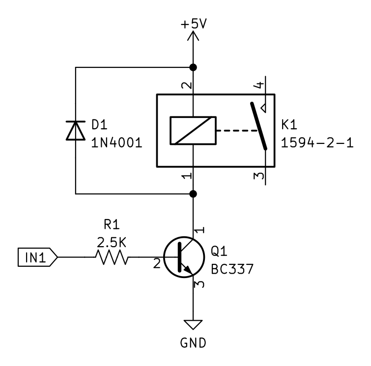
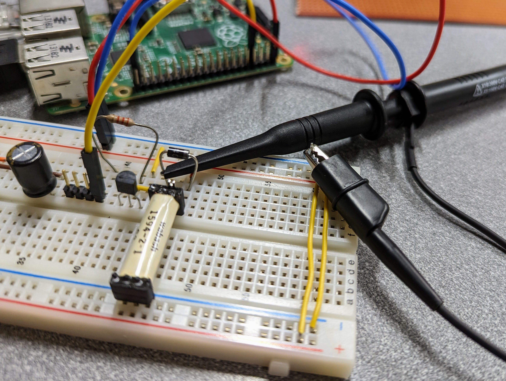
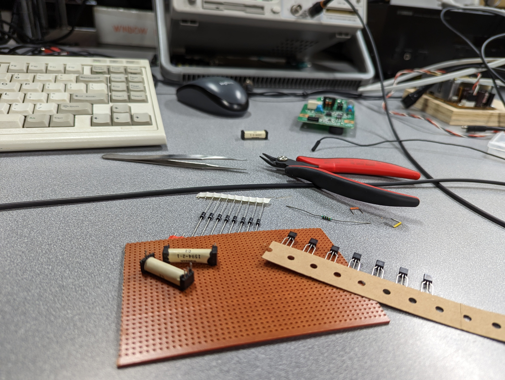
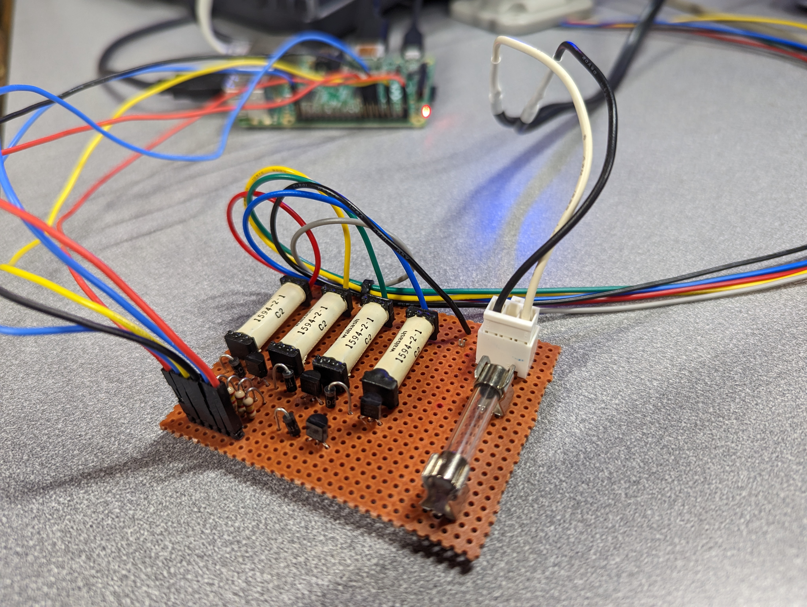
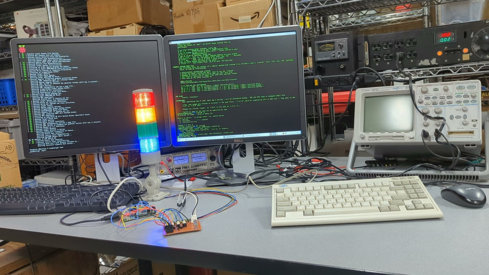
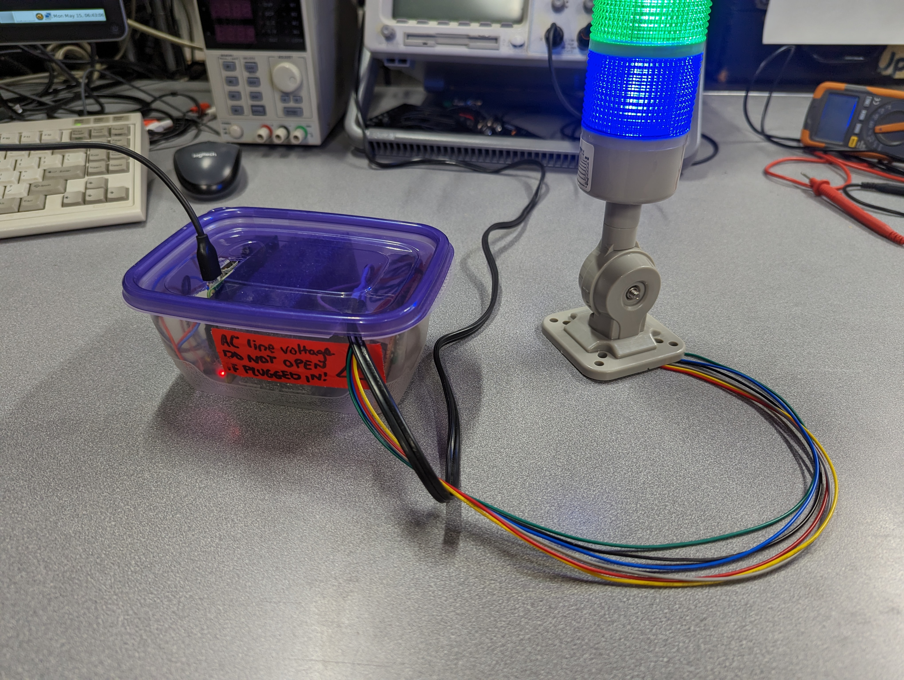

# Signal Tower Demo

I was given this signal tower and asked to interface it to Raspberry Pi GPIO outputs. The only problem is the lights are powered by 120/240 VAC, so obviously, the Pi can't drive it directly. I made this custom 4-channel driver board to get it going. The python scripts in this repo demonstrate how to interface to the lights using my driver board.

Here's the driver board schematic. This circuit is repeated for each channel:

Here are some photos from my weekend spent making the driver board:

 Prototyping the circuit.

 Getting the parts together.

 The finished board ready to plug in and test.

 Oh wow, it works!

 Safely packaged so nobody gets shocked.

Enjoy with beverage of choice!